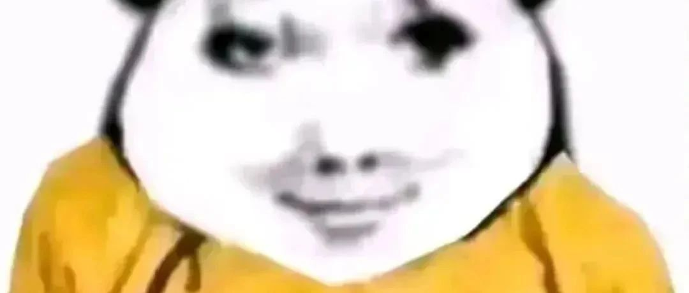
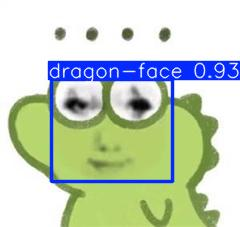
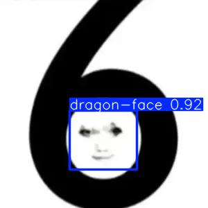
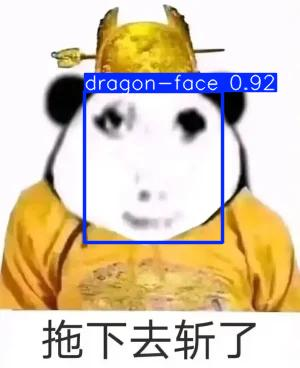
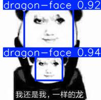

<h1 align="center">
  
   
  DragonRecognition
</h1>  
  
基于YOLOv8目标检测的龙图识别,训练集为600张龙图表情包

<h2 >
检测结果示例
</h2>  

   
   
   
  

 

<h2>模型</h2>

请前往 [Releases](https://github.com/danel-phang/DragonDetection/releases) 中下载模型。**best**为较好模型,**last**为较差模型

<h2>使用方法</h2>

<h3>1.直接使用命令行推理</h3>

    yolo detect predict model=path/to/best.pt source='https://ultralytics.com/images/bus.jpg'

<h3>2.对应python代码示例</h3>

    from ultralytics import YOLO
    from PIL import Image
    import cv2
    
    if __name__ == "__main__":
        model = YOLO("runs/detect/train/weights/best.pt")
        results = model.predict("data/train/images/test.png", line_width=10, conf=0.82)
        
        if results[0].boxes.shape[0] > 0:
            print("检测到目标")
            # BGR转RGB
            result_array = results[0].plot()
            result_array_rgb = cv2.cvtColor(result_array, cv2.COLOR_BGR2RGB)
            result_image = Image.fromarray(result_array_rgb)
            result_image.show()
            result_image.save("result.jpg")
        else:
            print("未检测到目标")
